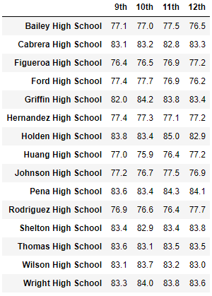

# School District Analysis

## Project Overview
A school board employee has asked you for the following metrics to assist in making decisions regarding schools' budgets and priorities.
1. A district summary which includes:
    - Total number of schools
    - Total number of students
    - Total budget
    - Average math score
    - Average reading score
    - Percentage of students passing math
    - Percentage of students passing reading
    - Overall passing percentage
2. A school summary which includes the same as above but for each school while also including school type.
3. The top 5 and bottom 5 schools based on overall passing percentage.
4. Average math and reading scores per:
    - Grade level
    - School spending
    - School size
    - School type

## Resources
- Data Source: schools_complete.csv, students_complete.csv
- Software: Anaconda 4.8.3, Jupyter Notebook 6.0.3, Python 3.7.7, Visual Studio Code 1.47.2

## Summary
District Summary

School Summary

Top 5 performing schools

Bottom 5 performing schools

Average Math Scores per Grade Level | Average Reading Scores per Grade Level
:----------------------------------:|:-------------------------------------:
 | 

Average Scores by School Spending

Average Scores by School Size

Average Scores by School Type

## Challenge Overview
The school board has notified you that the reading and math scores for Thomas High School ninth greaders appear to have been altered. You are tasked to replace these scores with`NaN`while keeping the rest of the data intact. You are then to repeat the school distrct analysis and describe how these changes affected the overall analysis.

## Challenge Results
The analysis of the altered scores show the following:

- Looking at the district summary, we can see that:
    - Average math score dropped from **79.0%** to **78.9%**
    - Percentage of students passing math dropped from **75%** to **74%**
    - Percentage of students passing reading dropped from **86%** to **85%**
    - Overall passing percentage dropped from **65%** to **64%**

- 

Before applying NaN to Thomas HS's 9th graders, avg math score was 79.0, avg reading score was 81.9, % passing math was 75, % passing reading was 86, % overall passing was 65

