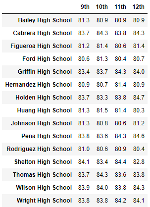
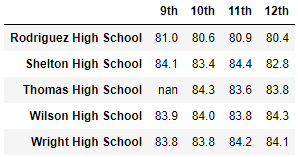

# School District Analysis

## Project Overview
A school board employee has asked you for the following metrics to assist in making decisions regarding schools' budgets and priorities.
1. A district summary which includes:
    - Total number of schools
    - Total number of students
    - Total budget
    - Average math score
    - Average reading score
    - Percentage of students passing math
    - Percentage of students passing reading
    - Overall passing percentage
2. A school summary which includes the same as above but for each school while also including school type.
3. The top 5 and bottom 5 schools based on overall passing percentage.
4. Average math and reading scores per:
    - Grade level
    - School spending
    - School size
    - School type

## Resources
- Data Source: schools_complete.csv, students_complete.csv
- Software: Anaconda 4.8.3, Jupyter Notebook 6.0.3, Python 3.7.7, Visual Studio Code 1.47.2

## Summary
District Summary

School Summary

Top 5 performing schools

Bottom 5 performing schools

Average Math Scores per Grade Level | Average Reading Scores per Grade Level
:----------------------------------:|:-------------------------------------:
 | 

Average Scores by School Spending

Average Scores by School Size

Average Scores by School Type

## Challenge Overview
The school board has notified you that the reading and math scores for Thomas High School ninth graders appear to have been altered. You are tasked to replace these scores with `NaN` while keeping the rest of the data intact. You are then to repeat the school district analysis and describe how these changes affected the overall analysis.

## Challenge Results
The analysis of the altered scores show the following:
- Looking at the district summary, we can see that:

    - Average math score dropped from **79.0%** to **78.9%**
    - Percentage of students passing math dropped from **75%** to **74%**
    - Percentage of students passing reading dropped from **86%** to **85%**
    - Overall passing percentage dropped from **65%** to **64%**

- Looking at the school summary, we can see that:

    - Average math score dropped from **83.42%** to **83.35%**
    - Percentage of students passing math dropped from **93.27%** to **66.91%**
    - Percentage of students passing reading dropped from **97.31%** to **69.66%**
    - Overall passing percentage dropped from **90.95%** to **65.08%**

- Looking at the top 5 performing schools, we can see that replacing ninth grader's scores for Thomas High School has dropped their performance to below top 5. However, Thomas High School's performance has not dropped to bottom 5 yet.

- Looking at the average math and reading scores per school, we can see that there is no average for ninth graders for Thomas High School. This reflects our alteration of replacing these scores with `Nan`.

Average Math Scores per Grade Level | Average Reading Scores per Grade Level
:----------------------------------:|:-------------------------------------:
 | 

- Looking at the average scores by school spending, we can see that the only change was a drop in percentage of students passing math, percentage of students passing reading, and overall passing percentage. This only appears in the $630-644 range as Thomas High School is in this spending range.
    - Percentage of students passing math dropped from **73%** to **67%**
    - Percentage of students passing reading dropped from **84%** to **77%**
    - Overall passing percentage dropped from **63%** to **56%**

- Looking at the average scores by school size, we can see that the only change was a drop in percentage of students passing math, percentage of students passing reading, and overall passing percentage. This only appears in the medium school size as Thomas High School is a medium-sized school.
    - Percentage of students passing math dropped from **94%** to **88%**
    - Percentage of students passing reading dropped from **97%** to **91%**
    - Overall passing percentage dropped from **91%** to **85%**

- Looking at the average scores by school type, we can see that the only change was a drop in percentage of students passing math, percentage of students passing reading, and overall passing percentage. This only appears in charter school type as Thomas High School is a charter school.
    - Percentage of students passing math dropped from **94%** to **90%**
    - Percentage of students passing reading dropped from **97%** to **93%**
    - Overall passing percentage dropped from **90%** to **87%**

## Challenge Summary
There have been several major changes to the school district analysis after the reading and math scores for Thomas High School ninth graders have been replaced. Firstly, the passing percentage for both math and reading and the overall passing percentage for Thomas High School dropped significantly. Secondly, there is a drop in percentage of students passing math, percentage of students passing reading, and overall passing percentage for the $630-644 spending range. We can see drops in the same categories for medium-sized schools and charter schools. This is because a drop in percentage of students passing math, percentage of students passing reading, and overall passing percentage for Thomas High School itself would affect these school categories because Thomas High School is classied as a medium charter school with a spending of between $630-644 per student.

